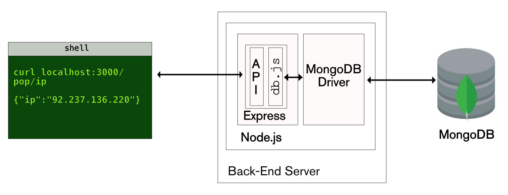

# [Bootcamp Web Developer Full Stack](https://www.thebridge.tech/bootcamps/bootcamp-fullstack-developer/)
### JS, ES6, Node.js, Frontend, Backend, Express, React, MERN, testing, DevOps

## Introducción a BBDD NoSQL con MongoDB

V
- [MongoDB](https://www.mongodb.com/es)
- [MongoDB | NoSQL Explained](https://www.mongodb.com/es/nosql-explained)
- [7-razones-mongodb](https://platzi.com/blog/7-razones-mongodb/)
- [que-es-mongodb](https://openwebinars.net/blog/que-es-mongodb/)
- [mongodb-cloud](https://www.arsys.es/blog/programacion/mongodb-cloud/)
- [mysql-vs-mongodb-cuando-y-donde-usar-cada-uno](https://impactotecno.wordpress.com/2018/02/26/mysql-vs-mongodb-cuando-y-donde-usar-cada-uno)
- [mongodb-como-funciona](https://siliconnews.plataformasinc.es/mongodb-como-funciona/)

### NoSQL con MongoDB - Estructura

- Colecciones

- Documentos


### Modelado de datos en MongoDB

- Modelo de datos embebido

- [MongoDB | model-embedded-one-to-one-relationships-between-documents](https://docs.mongodb.com/manual/tutorial/model-embedded-one-to-one-relationships-between-documents/)

- Modelo de datos normalizado

- [MongoDB | database-references](https://docs.mongodb.com/manual/reference/database-references/)

Más info:
- [MongoDB | data-model-design](https://docs.mongodb.com/manual/core/data-model-design/)
- [MongoDB - Relationships | Tutorialspoint](https://www.tutorialspoint.com/mongodb/mongodb_relationships.htm)


### CRUD en MongoDB - Operaciones básicas
>En informática, CRUD es el acrónimo de "Crear, Leer, Actualizar y Borrar", que se usa para referirse a las funciones básicas en bases de datos o la capa de persistencia en un software. [Wikipedia](https://es.wikipedia.org/wiki/CRUD)


- [crud-las-principales-operaciones-de-bases-de-datos](https://www.ionos.es/digitalguide/paginas-web/desarrollo-web/crud-las-principales-operaciones-de-bases-de-datos/)
- [operaciones-crud-en-mongodb](https://platzi.com/contributions/operaciones-crud-en-mongodb/)
- [cosas-basicas-de-un-crud-en-mongodb](https://platzi.com/tutoriales/1533-mongodb/4102-cosas-basicas-de-un-crud-en-mongodb/)
- [MongoDB | Cheatsheet](https://www.mongodb.com/developer/products/mongodb/cheat-sheet/)

### MongoDB - Agregación
Las operaciones basadas en agregaciones nos permiten procesar datos que tenemos registrados para obtener resultados que aportan información útil. En otras palabras, nos permiten darle más valor a los datos que tenemos al transformarlos en información. 

La agregación en MongoDB sigue una estructura tipo "pipeline": diferentes etapas, donde cada una toma la salida de la anterior.


- [MongoDB | aggregation](https://docs.mongodb.com/manual/aggregation/)
- [Tutorial | mongodb-aggregation-framework](https://studio3t.com/knowledge-base/articles/mongodb-aggregation-framework/)
- [mongodb-aggregation | tutorialsteacher](https://www.tutorialsteacher.com/mongodb/aggregation)

### MongoDB - Schema validation
- [MongoDB | schema-validation](https://docs.mongodb.com/manual/core/schema-validation/)
- [how-to-use-schema-validation-in-mongodb | DigitalOcean](https://www.digitalocean.com/community/tutorials/how-to-use-schema-validation-in-mongodb)


### Instalacion de MongoDB + Compass
- [install-mongodb-on-os-x](https://docs.mongodb.com/manual/tutorial/install-mongodb-on-os-x/)
- [install-mongodb-on-windows](https://docs.mongodb.com/manual/tutorial/install-mongodb-on-windows/)
- [install-mongodb-on-ubuntu](https://docs.mongodb.com/manual/tutorial/install-mongodb-on-ubuntu/)
- [como-instalar-mongodb-en-ubuntu-18-04](https://www.digitalocean.com/community/tutorials/como-instalar-mongodb-en-ubuntu-18-04-es)
- [digitalocean | how-to-install-mongodb-on-ubuntu-20-04](https://www.digitalocean.com/community/tutorials/how-to-install-mongodb-on-ubuntu-20-04-es)
- [linuxize |how-to-install-mongodb-on-ubuntu-20-04](https://linuxize.com/post/how-to-install-mongodb-on-ubuntu-20-04/)

- [MongoDB | Compass](https://www.mongodb.com/products/compass)

### HolaMundo con MongoDB
Vamos a probar algunas operaciones sobre una BBDD de prueba con MongoDB para familiarizarnos con el entorno

- [MongoDB | CRUD operations](https://docs.mongodb.com/manual/crud/)
- [MongoDB | Tutorialspoint](https://www.tutorialspoint.com/mongodb/index.htm)

### MongoDB en nuestros lenguajes de programación
- [MongoDB | getting-started-with-python-and-mongodb](https://www.mongodb.com/blog/post/getting-started-with-python-and-mongodb)
- [w3schools| python_mongodb](https://www.w3schools.com/python/python_mongodb_getstarted.asp)
- [w3schools| node.js_mongodb](https://www.w3schools.com/nodejs/nodejs_mongodb.asp)

### ORM vs ODM
- [ORM vs ODM introduction](https://medium.com/spidernitt/orm-and-odm-a-brief-introduction-369046ec57eb)



### Mongoose: un Driver que nos sirve de ODM para MongoDB


Mongoose es un O.D.M (Object Document Modeling) para MongoDB en NodeJs con el que podemos crear Schemas para tipado de datos, esquematizar, validar, crear métodos y middlewares.

### ORM En SQL - Sequelize

Sequelize es un ORM para Nodejs que te permitirá agilizar bastante tus desarrollos que incluyan bases de datos relacionales como MySQL o PostgreSQL.


- [Sequelize](https://sequelize.org/)


### Ejemplos de ODM para MongoDB
- [python | mongoengine](https://github.com/MongoEngine/mongoengine)
- [Tutorial | mongoengine](https://realpython.com/introduction-to-mongodb-and-python/)
- [node.js | mongoose](https://mongoosejs.com/)


## Ejercicios
### Ejercicio 1 - BBDD Restaurante

1. Mostrar todos los documentos de la colección restaurantes
2. Mostrar los campos restaurant_id, nombre, distrito y cocina, pero excluya el campo _id para todos los documentos de la colección restaurantes
3. Mostrar los primeros 5 restaurantes que se encuentran en el distrito Bronx
4. Devolver los restaurantes que lograron una puntuación superior a 80 pero inferior a 100
5. Devolver los restaurantes que se ubican en un valor de latitud inferior a -95.754168
6. Devolver los restaurantes que no preparan cocina americana y lograron una puntuación superior a 70 y se ubicaron en una longitud inferior a -65.754168. Nota: Realice esta consulta sin usar el operador $and
7. Devolver los restaurantes que no preparan cocina americana y lograron un punto de calificación 'A' que no pertenece al distrito de Brooklyn. El documento debe mostrarse según la cocina en orden descendente.
8. Devolver los restaurantes que pertenecen al distrito Bronx y preparan platos americanos o chinos
9. Devolver ID del restaurante, nombre, distrito y la cocina para aquellos restaurantes que pertenecen al distrito de Staten Island o Queens o Bronx o Brooklyn
10. Devolver ID del restaurante, nombre, distrito y la cocina de aquellos restaurantes que lograron una puntuación que no supere los 10
11. Devolver ID del restaurante, el nombre y las calificaciones del restaurante para aquellos restaurantes que obtuvieron una calificación de "A" y obtuvieron un puntaje de 11 en una fecha ISO "2014-08-11T00: 00: 00Z" entre muchas fechas de encuesta
12. Devolver ID del restaurante, nombre, dirección y ubicación geográfica del restaurante de aquellos donde el segundo elemento de la matriz coord contiene un valor que es más de 42 y hasta 52
13. Crea un par de restaurantes que te gusten. Tendrás que buscar en Google Maps los datos de las coordenadas
14. Actualiza los restaurantes. Cambia el tipo de cocina 'Ice Cream, Gelato, Yogurt, Ices' por 'sweets'
15. Actualiza nombre del restaurante 'Wild Asia' por 'Wild Wild West'
16. Borra los restaurantes con latitud menor que -95.754168
17. Borra los restaurantes cuyo nombre empiece por 'C'


**Importación de datos en MongoDB**

[Datos ejercicio](./utils/ejercicioMongoDB)


**OPCIÓN 1 (la fácil)**:

En MongoCompass, creamos una colección. En dicha colección aparece el botón `add data`. Al pulsar en el botón aparecerá la opción de `Import File`. Pulsada esta opción nos aparecerá un cuadro de texto que nos permite seleccionar el archivo JSON que queremos importar en nuestra colección.

El ejercicio consta de dos colecciones que tenemos que importar. 

Los JSON de datos que queremos guardar te los adjuntamos en este ejercicio, en la carpeta utils. 

**OPCIÓN 2**:

El seeding nos permite importar grandes cantidades de datos a colecciones vacías. En este caso de adjuntamos la carpeta utils con dos JSON, uno referente a landings y otro referente a la colección neas. Para poder guardarlos dentro de nuestra base de datos de mongo, usaremos `mongoimport`.

```
mongoimport
```
1. Comprobar si tenemos instalado mongoimport

```
mongoimport --version
```
2. [Instalación de mongoimport]('https://docs.mongodb.com/database-tools/installation/installation/') (MongoDB Database Tools)

***

#### Uso
El comando neccesita que especifiquemos la __base de datos__, la __colección__, y la __ruta al archivo__ (csv y json)

```
mongoimport --db=[base-de-datos] --collection=[colección] [ruta/al/archivo]
```
Si usamos un json que se compone de un array de objetos deberemos pasar también un flag que lo especifique

```
mongoimport --jsonArray --db=[base-de-datos] --collection=[colección] [ruta/al/archivo]
```
***


### Ejercicio 2 - Aggregate

Añadir los siguientes documentos a la colección empleados:

```javascript
db.employees.insertMany([
    { 
        _id:1,
        firstName: "Muchelle",
        lastName: "Wallys",
        gender:'female',
        email: "muchelle@thebridgeschool.es",
        salary: 5000,
        department: { 
                    "name":"HR" 
                }
    },
    { 
        _id:2,
        firstName: "Marta",
        lastName: "Perez",
        gender:'female',
        email: "marta@demo.com",
        salary: 8000,
        department: { 
                    "name":"Finance" 
                }
    },
    { 
        _id:3,
        firstName: "Birja",
        lastName: "Rybera",
        gender:'male',
        email: "birja@thebridgeschool.es",
        salary: 7500,
        department: { 
                    "name":"Marketing" 
                }
    },
    { 
        _id:4,
        firstName: "Rosa",
        lastName: "Sanchez",
        gender:'female',
        email: "rosa@demo.com",
        salary: 5000, 
        department: { 
                    "name":"HR" 
                }

    },
    { 
        _id:5,
        firstName: "Alvaru",
        lastName: "Aryas",
        gender:'male',
        email: "alvaru@thebridgeschool.es",
        salary: 4500,
        department: { 
                    "name":"Finance" 
                }

    },
    { 
        _id:6,
        firstName: "Anita",
        lastName: "Rodrigues",
        gender:'female',
        email: "anita@demo.com",
        salary: 7000,
        department: { 
                    "name":"Marketing" 
                }
    },
        { 
        _id:7,
        firstName: "Alejandru",
        lastName: "Regex",
        gender:'male',
        email: "alejandru@thebridgeschool.es",
        salary: 7000,
        department: { 
                    "name":"Marketing" 
                }
    }
])
```

1. Devuelve todas las empleadas de la empresa usando $match
2. Devuelve un array de objetos que tenga en cada uno `{id_departamento,totalEmployees}` datos como en el siguiente ejemplo:
```javascript
[
  { _id: 'Marketing', totalEmployees: 2},
  { _id: 'HR', totalEmployees: 2},
  { _id: 'Finance', totalEmployees: 3}
]
```
3. Modifica el ejercicio anterior para que sólo devuelva datos de los empleados
4. Devuelve los datos de las empleadas ordenados por salario ascendente
5. Devuelve los datos de las empleadas por departamento ordenados por total salario ascendente para sacar una salida parecida a:
```javascript
[
  { _id: { deptName: 'Finance' }, totalEmployees: 2, totalSalaries: 12500},
  { _id: { deptName: 'HR' }, totalEmployees: 1, totalSalaries: 10000},
  { _id: { deptName: 'Marketing' }, totalEmployees: 2, totalSalaries: 5000}
]
```


