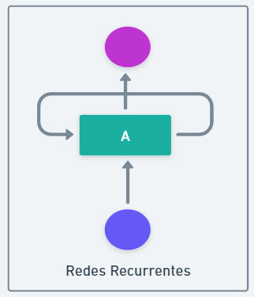

# Masterclass ChatGPT

## Preguntas sobre ChatGPT

- ¿Conoces ChatGPT?
- ¿Tienes una cuenta de ChatGPT?
- ¿Has usado ChatGPT en tu trabajo?
- ¿Has preguntado a ChatGPT dudas fuera de tu trabajo?

## ¿Qué es ChatGPT?

Chat GPT es un modelo de lenguaje desarrollado por [OpenIA](https://openai.com/). [OpenAI](https://openai.com/) es una organización de investigación en inteligencia artificial con sede en San Francisco, California. Fue fundada en 2015 por un grupo de investigadores en IA y empresarios, entre ellos Elon Musk, Sam Altman y Greg Brockman.

El objetivo de OpenAI es desarrollar tecnologías de IA de alta calidad y de libre acceso para la sociedad en general. Para lograrlo, la organización lleva a cabo investigaciones en una amplia variedad de áreas, como el aprendizaje profundo, el procesamiento del lenguaje natural y el juego automático.

Algunos de los productos más conocidos son: 
- [DALL-E2](https://openai.com/product/dall-e-2) -> es una herramienta de generación de imágenes por medio de inteligencia artificial. A través de lenguaje natural, es posible indicarle qué queremos que nos dibuje, y la IA creará una imagen única basada en la descripción que le hayamos dado.
- [Whisper](https://platform.openai.com/playground) -> Es un sistema de reconocimiento automático de voz. 
- [ChatGPT](https://chat.openai.com/chat) -> Se trata de un modelo de lenguaje que ha sido entrenado con una gran cantidad de datos de texto para poder realizar una amplia variedad de tareas relacionadas con el lenguaje natural. Su capacidad para comprender el contexto y la intención detrás de las preguntas o consultas de los usuarios lo convierten en una herramienta muy útil para desarrollar chatbots y mejorar la precisión en los sistemas de búsqueda de información.

### ChatGPT - Historia de versiones

- GPT (2018)
- GPT-2 (2019)
- GPT-3 (2020) -> llegada de chatGPT
- GPT-3.5 (2022) 
- [GPT-4](https://openai.com/product/gpt-4) (2023)

## ¿Cómo funciona ChatGPT?

### Algoritmo

ChatGPT está basado en versiones de GPT. GPT o Generative pre-trained transformer es un Modelo.

Un modelo es un programa, algoritmo, función que intenta replicar el comportamiento de un sistema. 

Un modelo podría ser predecir cuantas altás se van a producir en una página WEB. Coges datos de entrada y el modelo genera una predicción:

GPT es un modelo de lenguaje. En concreto es un modelo generativo, dado un texto, genera palabras. A diferencia de los modelos que hemos visto de imagen o sonido. 
El modelo te dice cual es la palabra más probable que habrá a continuación en un texto.

La version de ChatGPT está especialmente configurada para completar respuestas como si estuviéramos en un chat.
Todas las respuestas que te devuelve están generadas y son únicas, no está copiado de páginas web. 

Para poder hacer esto, GPT está basado en redes renuronales. Una red neuronal está diseñado para aprender a hacer tareas.

Hay cosas que una máquina no sabe que es hasta que se lo dices, para solucionar esto se creó el aprendizaje automático 
(machine learning), y las redes neuronales son un tipo de aprendizeje automático.

En el caso del lenguaje natural hay varios problemas a la hora de que un ordenador nos pueda entender. Por ejemplo si escribes 
"móvil", tu te imaginas un móvil pero el ordenador solo sabe de números o 0 y 1 en concreto. Todo lo que recibe un ordenador 
lo transforma en 0 y 1, imagenes, videos, audio, texto.. 

Para poder entrenar una red neuronal, para que nos entienda, hay que tener esto en cuenta.

Vamos a ver como funcinaría esta red neuronal teniendo en cuenta estas premisas. 

Siguiendo la imagen de un poco más arriba, vemos que una red neuronal recibe datos de entrada, estos serán las frases 
que se han usado de entrenamiento transformadas en números. 

Si analiza muchas secuencias de estos números la red neuronal puede encontrar patrones

Hay que recordar que el ordenador no lo interpreta como texto, sino como número y para poder entenderlo mejor, el modelo lo transforma en tokens.

El siguiente paso es utilizar marcadores para identiciar patrones. 

En el ejemplo anterior vemos que el la palabra "Vamos" está relacionada con "a". 

O por ejemplon que ChatGPT está relacioanada en muchos textos con Redes neuronales o NLP. De esta forma se puede encontrar
relacionles entre tokens. 

El resultado quedaría algo así:

Con gran cantidad de textos se podría crear una gran clasificación de términos y distintos patrones que irá encontrando. 

ChatGPT puede tener más de 300 marcadores por cada token con cercanía entre palabras. 

Otra forma de representarlo sería con una red neuronal, donde cada token se uniría con otro según la distancia a la que esté:

A este proceso de agrupar palabras similares se le llama embedding. También podríamos verlo con la siguiente representación:

Esto ya es útil por si solo porque tenemos un sitio donde buscar palabras similares que es algo parecido a lo que usa el buscador de google. 

La diferencia con GPT3 es que GPT3 no solo recuerda tokens a nivel de palabra sino también a nivel de frases. Crando así mas de 1000 marcadores por cada frase, 
y relacionar así frases entre sí. 
 

El proceso sabe que dentro de una frase sería complejo almacenar todo, por lo que almacena las frases tras realizar una limpieza. 
Por ejemplo en la frase anterior "una", "de", "en" aportan poco, podríamos decir "Estamos haciendo masterclass ChatGPT TheBridge". 
O Recucirlo más usando lematización, que es reducir la palabra al lema correspondiente:

>Todas las frases que nos devuelve ChatGPT lo devuelve de su sistema de embedding.

Cuando ChatGPT genera texto hace consultas a su embedding y lo que saca son estas secuencias de tokens que son frases comprimidas. 
Y posteriormente tiene que convertirlas a algo que entienda el lector buscando el token en en los embeddings, por eso no siempre te devuelve lo mismo
porque busca en los embedding y puede tener varios tonkens similares. 

Reduce y comprime al sistema básico y cuando lo tiene que devolver reconstruye con sus propias palabras.

Además de esto, utiliza una técnica que se llama **sampling** que es algo parecido a generar un número aleatorio para moverse dentro del embedding. 
Eso le hace moverse entre distintas frases. **Dando a parecer que se está inventando frases pero realmente son frases que ha aprendido en otro momento.**

### Transformers

Uno de los problemas en este tipo de redes que resuelve chatGPT es recordar la conversación anterior. Porque en lo que hemos visto anteriormente 
no estamos contando con que chatgpt si le has hecho varias preguntas recuerda las anteriores y te puede contestar en función de dos preguntas. 

Una técnica para solucionar esto son las redes recurrentes, que cogen como input la palabra anterior aunque estas tienen muchos problemas, uno de ellos es que 
no son paralelizables. Además con el paso de las palabras da más importancia a las nuevas y no a las viejas por lo que pierden valor. 

Sabiendo esto se utilizaron arquitecturas LSTM (Long Short-term memory). Que aunque es mucho mejor, sigue teniendo problemas como por ejemplo la parelización. 

El siguiente paso fue unir el funcionamiento de las redes recurrentes con el concepto de atención, que como el propio nombre dice, muestra atención 
a las frases y por cada palabra les da un porcentaje de cercanía hacia otras palabras, esta técnica mejoraba mucho el concepto anterior porque 
permitía tener un mapa por cada frase con palabras realacionadas con puntuación y permitía hacer búsquedas contextualizadas. 

Aunque esto fue un gran avance, en el 2017 unos empleados de google publicaron un paper con el titular "Attention is all you need" donde definían un nuevo 
concepto llamado "Transformers". 

Puedes consultar el paper que publicaron [aquí](https://proceedings.neurips.cc/paper/2017/file/3f5ee243547dee91fbd053c1c4a845aa-Paper.pdf)

Con este nuevo concepto, proponían que en lugar de hacer consultas recurrentes, se lanzasen todas las predicciones a la vez usando "Attention". 
Y ¿cómo sabe la posición de una palabra si se lanza todo a la vez? Como hemos visto realmente cada palabra para un ordenador no es un conjunto de letras, 
sino de números. La forma que solucionan es añadir información posicional en forma de números binarios 1, 2, 3.. para saber la posición que ocupan en una frase.

En el siguiente paper puedes entrar más en detalle de cómo funciona [The Positional Encoding](https://kazemnejad.com/blog/transformer_architecture_positional_encoding)

### Entrenamientos ChatGPT:

- Cuando entrenaron GPT usaron 117 millones de parametros. 
- Cuando entrenaron GPT-2 usaron 1.5 miles de millones de parametros. 
- Cuando entrenaron ChatGPT (GPT-3) usaron 175 miles de millones de parámetros. 
- Cuando entrenaron (GPT-4) han usado más de 100 Billones de parámetros. 

