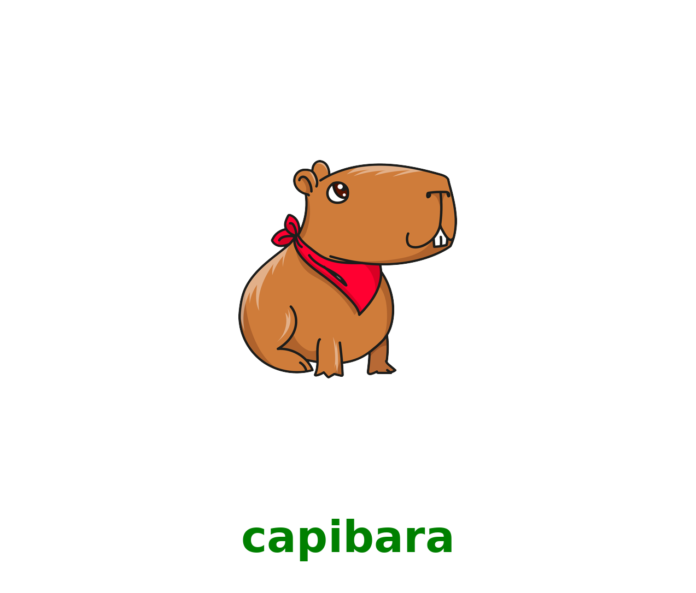

# Capibara

<div style="text-align:center">
    
</div>

[](https://www.python.org/downloads/)
[](https://opensource.org/licenses/MIT)

Capibara is a powerful Python library designed to streamline data science workflows. It provides a comprehensive suite of tools for data analysis, processing, visualization, and machine learning tasks.

## Features

- **Data Analysis**: Robust tools for exploratory data analysis and statistical computations
- **Data Processing**: Efficient data cleaning and transformation utilities
- **Data Visualization**: Beautiful and interactive visualization capabilities
- **Machine Learning**: Simplified interfaces for common ML tasks

## How to Use This Project

### Step 1: Prerequisites
- Make sure you have Python 3.9.6 installed
- Download or clone this repository to your local machine

### Step 2: Installation
1. Open a terminal in the project directory
2. Install the required dependencies:
```bash
pip install -r requirements.txt
```
3. Install the package:
```bash
pip install -e .
```

### Step 3: Basic Usage
```python
import pandas as pd
import capibara as cp

# Create or load your data
df = pd.DataFrame({
    'age': [25, 30, 35, 40],
    'salary': [30000, 45000, 50000, 60000],
    'category': ['A', 'B', 'A', 'B']
})

# 1. Analyze your data
analysis = cp.data_analysis.basic_data_analysis(df)
print("Basic Analysis:", analysis)

# 2. Process your data
df_processed = cp.data_processing.create_dummies(df, ['category'])

# 3. Visualize your data
figures = cp.data_visualization.plot_numeric_distributions(df, ['age', 'salary'])
for fig in figures:
    fig.show()

# 4. Apply machine learning
X = df_processed.drop('salary', axis=1)
y = df_processed['salary']
model, metrics = cp.machine_learning.linear_regression(X, y)
print("Model Metrics:", metrics)
```

## Available Functions

### Data Analysis
- `filter_rows()`: Filter DataFrame rows based on conditions
- `remove_outliers()`: Remove outliers from datasets
- `basic_data_analysis()`: Perform comprehensive data analysis
- `outlier_meanSd()`: Detect outliers using mean and standard deviation
- `data_report()`: Generate detailed data reports
- `missing_values_summary()`: Analyze missing values

### Data Processing
- `create_dummies()`: Create dummy variables
- `fill_zeros_with_mean()`: Replace zeros with mean values
- `fill_nans_with_mean()`: Handle missing values
- `convert_to_numeric()`: Convert categorical to numeric data

### Data Visualization
- `plot_numeric_distributions()`: Visualize numeric distributions
- `plot_pie_charts()`: Create pie charts
- `plot_interactive_line_chart()`: Generate interactive line charts
- `plot_interactive_pie_chart()`: Create interactive pie charts

### Machine Learning
- `linear_regression()`: Perform linear regression
- `calculate_metrics()`: Calculate model performance metrics
- `unSupervisedCluster()`: Perform clustering analysis
- `gradient_boosting_regression()`: Apply gradient boosting
- `xgboost_regression()`: Implement XGBoost regression
- `random_forest_regression()`: Use random forest regression
- `most_common_words()`: Analyze text data
- `y_generator()`: Generate target variables

## Contributing

We welcome contributions! Please feel free to submit a Pull Request.

## License

This project is licensed under the MIT License - see the [LICENSE](LICENSE) file for details.

---

Made with ❤️ by data scientists for data scientists